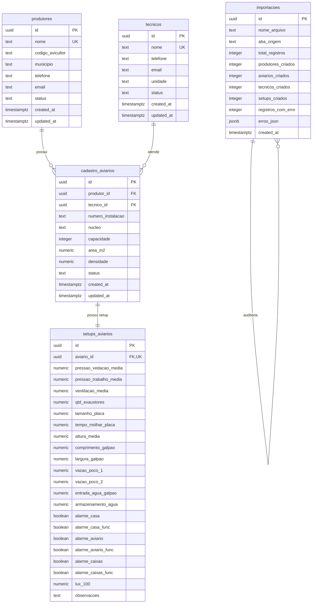

# Documentação Técnica e Funcional do Sistema
## Ficha Cadastral de Produtores & Setup de Granjas • Bello Alimentos

---

## 1. 📌 Visão Geral do Projeto

O sistema foi desenvolvido para centralizar, padronizar e agilizar a gestão cadastral de produtores avícolas, aviários/instalações e suas respectivas fichas técnicas de setup de granjas da **Bello Alimentos**.

A plataforma soluciona a fragmentação de dados através de:
- **Importação inteligente de planilhas Excel** com validação rigorosa e detecção automática de divergências.
- **Visualização dinâmica em cascata** (`Produtor` ➔ `Aviário` ➔ `Ficha de Setup`).
- **Ficha Técnica de Setup de Granja** 100% aderente ao padrão oficial em PDF da Bello Alimentos com suporte a edição em tempo real e impressão.
- **Gestão completa de Extensionistas/Técnicos** (cadastro, edição, desvinculação e exclusão segura).
- **Persistência em Nuvem** via **Supabase (PostgreSQL 15)** com políticas de segurança e integridade referencial.

---

## 2. 🏗️ Arquitetura e Stack Tecnológica

| Camada | Tecnologia | Descrição |
|---|---|---|
| **Frontend Core** | React 19 + TypeScript | Interface declarativa, reativa e tipagem estática rigorosa |
| **Estilização** | Tailwind CSS v4 + Vanilla CSS | Design system moderno em tons escuros (dark mode) com a paleta Bello |
| **Ícones** | Lucide React | Conjunto de ícones consistentes para toda a UI |
| **Processamento Excel** | SheetJS (`xlsx`) | Leitura de planilhas binárias no cliente com alta performance |
| **Backend & Banco de Dados** | Supabase (PostgreSQL 15) | REST API via PostgREST, Row Level Security (RLS) e Triggers |
| **Build & Runtime** | Vite + Bun / Node.js | Bundling ultrarrápido com Hot Module Replacement (HMR) |

---

## 3. 🗄️ Modelagem de Banco de Dados (Supabase / PostgreSQL)

O arquivo com o script completo de criação das tabelas encontra-se em [`supabase_schema.sql`](file:///c:/Projetos/Ficha%20Cadastral%20Produtores/supabase_schema.sql).

### 3.1. Estrutura das Tabelas



### 3.2. Regras de Integridade e Chaves
- **Produtores**: Unicidade por `nome`.
- **Extensionistas/Técnicos**: Unicidade por `nome`.
- **Aviários**: Unicidade composta `(produtor_id, numero_instalacao)`.
- **Setups**: Relacionamento 1:1 único com `aviario_id`.
- **Exclusão Segura**: A exclusão de um técnico desvincula os aviários sem apagá-los (`tecnico_id = NULL`).

---

## 4. ⚙️ Funcionalidades Implementadas

### 4.1. ⬆️ Importação Inteligente de Planilhas Excel
- **Seleção e Arrastar de Arquivos**: Suporta `.xlsx` e `.xls`.
- **Detecção Automática de Abas**: Seleciona automaticamente a aba `Tbl_txt` (ou a primeira disponível).
- **Engine Tolerante de Mapeamento**: Reconhece 25 variações de cabeçalhos ignorando acentuação, maiúsculas/minúsculas e espaços extras.
- **Pré-visualização e Validação**:
  - Cards de contagem: Total de Linhas, Produtores Únicos, Aviários, Técnicos e Pendências.
  - Tabela interativa com status linha a linha e filtros por status (Válidas / Com Erro).
- **Upsert Idempotente**: Não duplica registros se a planilha for importada múltiplas vezes.
- **Barra de Progresso Animada**: Etapas monitoradas em tempo real (`Técnicos` ➔ `Produtores` ➔ `Aviários` ➔ `Setups` ➔ `Finalizando`).
- **Download de Erros em CSV**: Permite exportar as linhas com inconsistências para correção.

---

### 4.2. 📋 Ficha Técnica Oficial de Setup de Granja
- **Fidelidade Visual ao PDF da Bello Alimentos**:
  - **Pressão de Vedação & Pressão de Trabalho**: Exaustor, Manômetro, Painel e Médias.
  - **Ventilação Total**: Velocidade do vento (Lateral Direita, Meio, Lateral Esquerda, Média) e Quantidade de Exaustores.
  - **Ventilação Entrada de Ar**: Lado 01 Fornos e Lado 02 (Frente, Centro, Fundo).
  - **Iluminação / Lux**: Sob Lâmpada, Lateral, Triângulo e Lux 100%.
  - **Placa Evaporativa**: Área da placa (m²) e tempo de molhamento (min).
  - **Dimensões do Galpão**: Alturas (Frente, Meio, Fundo, Média), Comprimento e Largura.
  - **Recursos Hídricos**: Vazão Poço 1 e 2, Entrada de Água e Armazenamento.
  - **Painel de Alarmes**: Status com badges visuais (Casa, Aviário, Caixas Centrais).
- **Modo de Edição Direta**: Permite ao usuário editar qualquer campo e salvar diretamente no banco de dados.
- **Impressão Oficial / PDF**: Estilo preparado para impressão limpa no formato oficial.

---

### 4.3. 🔍 Filtro Inteligente em Cascata & Navegação
- **Passo 1 - Seleção de Produtor**: Dropdown dinâmico com busca e contagem.
- **Passo 2 - Aviários do Produtor**: Chips interativos com status e seleção rápida de aviários.
- **Passo 3 - Ficha Técnica**: Atualização instantânea dos parâmetros do aviário selecionado.

---

### 4.4. 👨‍🌾 Visão de Produtores
- Listagem geral em formato de cartões com total de aviários e atalhos diretos.
- Indicador do extensionista responsável por cada lote.

---

### 4.5. 👷 Visão de Extensionistas & Gestão Completa (CRUD)
- **Botão "+ Cadastrar Extensionista"**:
  - Modal com validação de campos obrigatórios (Nome Completo) e complementares (Unidade, Telefone/WhatsApp, E-mail).
- **Edição em Tempo Real**:
  - Botão de edição em cada cartão para atualizar contatos ou lotação.
- **Exclusão Segura**:
  - Modal de confirmação inteligente com alerta de quantidade de aviários atendidos, garantindo que os aviários continuem salvos e apenas sejam desvinculados do técnico removido.
- **Chips de Navegação Rápida**: Atalho direto para abrir os aviários atendidos por aquele técnico.

---

### 4.6. 📜 Histórico & Auditoria de Importações
- Registro de cada lote importado com data/hora, quantidade de registros criados/atualizados e autor da importação.
- Download direto do relatório de erros em CSV de importações anteriores.

---

### 4.7. 🎨 Identidade Visual Oficial
- Logotipo oficial da Bello Alimentos (`Logo_Bello.png`) integrado no cabeçalho global e no cabeçalho das fichas técnicas com molduras de alto contraste e legibilidade.

---

## 5. 🛠️ Como Executar e Configurar

### 5.1. Variáveis de Ambiente (`.env`)
```env
VITE_SUPABASE_URL="https://evzmmdteliaupztfqepl.supabase.co"
VITE_SUPABASE_ANON_KEY="sb_publishable_OooYawrnpBv0JRjkWxMHxQ_4K2m6T__"
```

### 5.2. Comandos de Execução
```bash
# Instalação das dependências
bun install # ou npm install

# Execução em ambiente de desenvolvimento
bun dev     # ou npm run dev

# Build de produção
bun run build # ou npm run build
```

---

## 6. 📁 Estrutura de Arquivos

```
├── .env                       # Configuração de chaves do Supabase
├── supabase_schema.sql        # Script SQL completo de criação do banco
├── DOCUMENTACAO.md            # Esta documentação completa
├── README.md                  # Apresentação do repositório
├── public/
│   └── Logo_Bello.png         # Logo oficial da marca
├── src/
│   ├── App.tsx                # Orquestrador de estado e abas
│   ├── main.tsx               # Entrypoint React
│   ├── index.css              # Estilização global Tailwind v4
│   ├── types/
│   │   └── database.ts        # Tipagens TypeScript completas
│   ├── services/
│   │   ├── supabase.ts        # Instância do cliente Supabase
│   │   ├── dataService.ts     # Operações de CRUD e consultas
│   │   └── importService.ts   # Engine de parsing e processamento Excel
│   └── components/
│       ├── Header.tsx         # Cabeçalho com logo e contadores
│       ├── BelloLogo.tsx      # Componente de renderização do logo
│       ├── CascadeFilterBar.tsx # Barra de filtro cascata Produtor -> Aviário
│       ├── FichaSetupCard.tsx # Ficha técnica de setup e edição
│       ├── ProdutoresView.tsx # Visão de cartões de produtores
│       ├── TecnicosView.tsx   # Gestão completa de Extensionistas (CRUD)
│       ├── ImportModal.tsx    # Modal de upload, validação e importação
│       └── ImportHistoryView.tsx # Histórico de logs de importação
```
